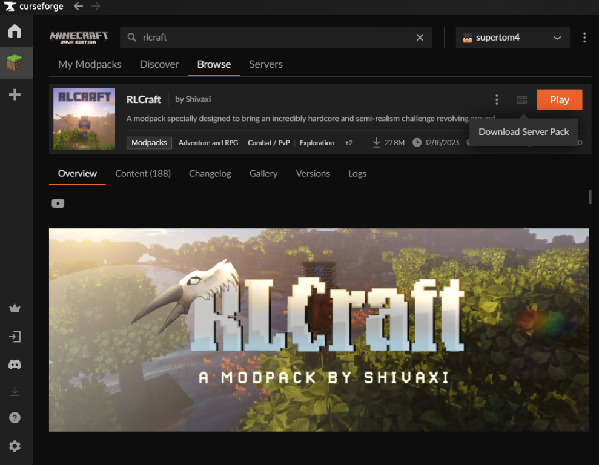
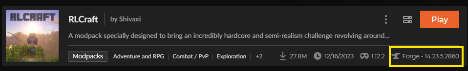
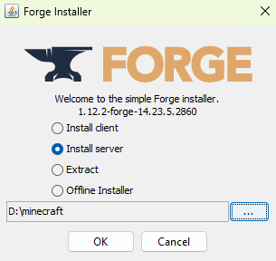

# minecraft
Running a Minecraft Server on a Kubernetes cluster at home.

I use [Podman](https://podman.io/) to build images, setup instructions are [here](https://podman.io/docs/installation).

There are multiple image build files  
- [x] Dockerfile: Build image to run a Vanilla Minecraft Server
- [x] Dockerfile-neoforge: If you want to have mod - use the Neoforge server setup and copy it into the image
- [x] Dockerfile-RL-Craft: If you want to run the [RL-Craft](https://www.curseforge.com/minecraft/modpacks/rlcraft) mod - use [Curseforge](https://www.curseforge.com/) with the Neoforge server package

### 1 Build an Vanilla image
```
 podman build -t my-registry.azurecr.io/minecraft-server:1.21.1 -f .\Dockerfile .
```

### 2 Build a NeoForge image
Ok, lets install [Java 21](https://www.oracle.com/java/technologies/downloads/#java21) and [Neoforge](https://neoforged.net/) first.  [Java verion requirements are here](https://docs.neoforged.net/user/docs/#java).
After that - check the required Minecraft version for you Mods on Neoforge, in my case it`s 1.21.1. 
Download the neoforge server installer version you need from [https://maven.neoforged.net/releases/net/neoforged/neoforge/](https://maven.neoforged.net/releases/net/neoforged/neoforge/) in my case it's
```
wget https://maven.neoforged.net/releases/net/neoforged/neoforge/21.1.1/neoforge-21.1.1-installer.jar -OutFile neoforge-21.1.1-installer.jar
```
Run the installer, select install server and give it a target directory. This is the source directy in the Dockerfile server/
Now, select the Mods you want to have in Neoforge and install them. Copy the mods from your Minecraft client installation in /mods to the server/mods directory. You`re ready to build your custom Minecraft image.

```
podman build -t my-registry.azurecr.io/minecraft-server-neoforge:1.21.1 -f .\Dockerfile-neoforge .
```

### 3 Build a RL Craft image

- Install the [Cursforge](https://www.curseforge.com) client, search for the [RL Craft mod](https://www.curseforge.com/minecraft/modpacks/rlcraft/gallery) and install it.  Open the profile and click `Download Server Pack`  
[]

- RL Craft uses Minecraft 1.12.2 which is based on Java 8, lets install it to unpack the server binaries[Java 8](https://www.java.com/en/download/manual.jsp)

- In my case modloader Forge in version 14.23.5.2860 is used.
[]
 Lets get the server binaries here: [https://files.minecraftforge.net](https://files.minecraftforge.net/net/minecraftforge/forge/index_1.12.2.html)

- Run the server install und unpack it to folder `minecraft`  
[]

- Unpack the sever pack into folder `minecraft`  

Build the image with
```
podman build -t my-registry.azurecr.io/minecraft-server-rl-craft:1.12.2 -f .\Dockerfile-rl-craft .
```

### Run local
```
podman run --rm -p 25565:25565 my-registry.azurecr.io/minecraft-server:1.21.1
```

### push image to a container registry
I'm using a Azure Container Registry here. 
Login with:
```
az login
az acr login --name my-registry --expose-token --query accessToken -o tsv | podman login my-registry.azurecr.io --username 00000000-0000-0000-0000-000000000000 --password-stdin  
 ```
push the image
```
podman image push my-registry.azurecr.io/minecraft-server-neo-jei-world-10-23:1.21.1
```